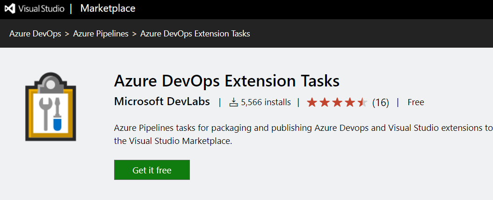
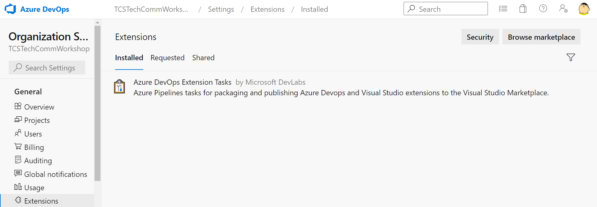
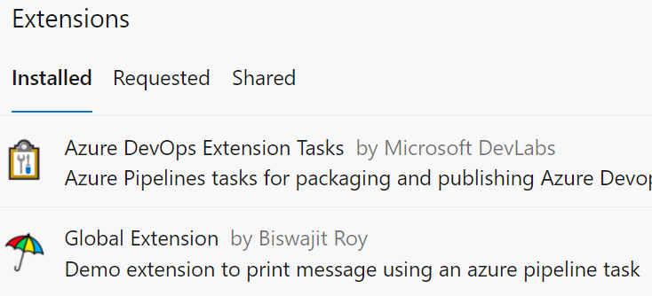

# Azure DevOps Extensions Workshop

| Pipelines | Status |
| :--: | :--: |
| Extension build and release | [](https://dev.azure.com/TCSTechCommWorkshop/CDaaSGlobal/_build/latest?definitionId=1&branchName=master) |
| Extension consumer | [](https://dev.azure.com/TCSTechCommWorkshop/CDaaSGlobal/_build/latest?definitionId=4&branchName=main) |

This repository contains modules for the workshop on building azure devops extensions
to help collegues get started with [azure devops extensions](https://docs.microsoft.com/en-us/azure/devops/extend/overview?view=azure-devops)

<details>
<summary><b>Table of Contents</b> <I>(click to open)</I></summary>

- [Prerequisites](#prerequisites)
- [Preparing the extension](#preparing-the-extension)
  - [Setup the workspace](#setup-the-workspace)
  - [Setup the marketplace service connection](#setup-the-marketplace-service-connection)
  - [Create the publisher](#create-the-publisher)
  - [Setup the Azure DevOps Pipeline](#setup-the-azure-devops-pipeline)
- [Using the extension](#using-the-extension)
  - [Install the extension](install-the-extension)
  - [Setup the consumer pipeline](#setup-the-consumer-pipeline)

</details>

## Prerequisites

The workshop assumes that you know and have access to the following resources:

- [x] Javascript/Typescript
- [x] Sinon, Mocha, Chai testing
- [x] Node.js
- [x] GNU Make
- [x] [Azure DevOps Account](https://azure.microsoft.com/en-us/services/devops/)

## Preparing the extension

### Setup the workspace

1. Sign in to [Azure DevOps](https://dev.azure.com/) using your personal microsoft account.

2. Create an organization. You can provide any name, make sure it's a unique one.

3. Create 2 projects by clicking the `New Project` button.

    - The first project will hoist your extension-code and release pipeline.

    - The purpose of the second project is to demonstrate that extension tasks are avalable cross-organization.

4. Create a repository in the first project space for your extension code.

5. We'll need to install the necessary [Azure DevOps Extension Tasks](https://marketplace.visualstudio.com/items?itemName=ms-devlabs.vsts-developer-tools-build-tasks) by Microsoft installed to build and release azure devops extensions.

    - _Install the extension._

      

    - _Check if the extension is correctly installed by visiting <OrganizationName> -> Organization settings -> Extensions._

      

6. Clone the repository code and delete the current git remote using below steps.
(We will upload the same code to the azure repository).

    ```shell
    # Git clone the repository
    https://github.com/Biswajee/Azure-DevOps-Extensions-Workshop.git

    # Remove the remote url for the cloned repo
    git remote remove origin

    # Add the new remote url from your azure devops extension repository
    git remote add origin https://<OrganizationName>@dev.azure.com/<OrganizationName>/<ProjectName>/_git/<AzureRepositoryName>
    git push -u origin --all
    ```

7. Check whether the code you've pushed got successfully updated in the azure devops respository.

Horray! You've completed the first subtask 🎉🎉

### Setup the marketplace service connection

1. Go to the project space where your extension repository is present.

2. `[User Settings]` > `[Personal access tokens]` > `[ + New Token]`.

    

3. `[Project Settings]` > `[Service Connections]` > `[Create Service Connection]`.

4. In the search bar, find **Visual Studio Marketplace**. Click Next.

5. Add your personal access token that you copied.

6. Provide the name of the service connection and an optional description.

7. Make sure the **Grant access permission to all pipelines** is checked ✅.

_Please note the name of the service connection after creating._

### Create the publisher

1. Go to the [publish your extension](https://marketplace.visualstudio.com/manage/createpublisher?managePageRedirect=true) page and create a publisher. Please note the **publisher ID** after creating.

_(Any details other than the name of the publisher and the publsher id are optional.)_

### Setup the Azure DevOps Pipeline

The Azure DevOps pipeline is located at the root of the project
[here](./az-build-and-release-pipeline.yaml).
Please update the values in the variable section of the pipeline (Line 19 to 29) as under:

```yaml
variables:
  # the publisher id you've created
  publisherId: <YOUR-PUBLISHER-ID>
  # the value of url after https://dev.azure.com/<YOUR-ORGANIZATION-NAME>
  # this value will be used to share the produced extension with the organization
  # multiple values can be provided as shown: organization1,organization2
  shareWithOrganization: <YOUR-ORGANIZATION-NAME>
  # example of organization url: https://dev.azure.com/biswajitr
  shareWithOrganization.URLs: <YOUR-ORGANIZATION-URL> 
  # the name of the marketplace service connection that you've created
  marketplaceServiceConnectionName: <YOUR-MARKETPLACE-SERVICE-CONNECTION>
```

Now, we're ready to create our first pipeline 🎉

1. Click the pipelines icon in the azure devops platform.

2. Click on `[ New Pipeline ]` button.

3. Select following responses when prompted:

    - Where is your code: Azure Repos Git

    - Select a repository: <YOUR-REPOSITORY>

    - Configure your pipeline: Existing Azure Pipelines YAML file

    - Enter pipeline path as: `/az-build-and-release-pipeline.yaml`

Click on **continue** to setup your pipeline.

Review your pipeline YAML and hit **run** to execute the pipeline.

## Using the extension

Now that your build and release pipelines executed successfully, we can test our extension
using another pipeline. Before, we can do that you must ensure that the extension is shared
with the organization where you're trying to use.

### Install the extension

The azure devops extension gets automatically installed in the target organization
when the build is triggered using the azure pipelines.

_You can verify whether the extension is installed properly by visiting <OrganizationName> -> Organization settings -> Extensions._
or `https://dev.azure.com/<OrganizationName>/_settings/extensions?tab=installed`.



### Setup the consumer pipeline

Now, we are ready to test our azure devops extension tasks in all the shared organizations.
Your personal Azure DevOps might allow pipelines to execute only in one project space.
If you're able to run pipelines in different projects in the same organization, you can
set up the below pipeline anywhere within the shared organizations.

1. Create another repository in the same organization and project.

2. Create a new pipeline using the following steps:

    1. Click the pipelines icon in the azure devops platform.

    2. Click on `[ New Pipeline ]` button.

    3. Select following responses when prompted:

        - Where is your code: Azure Repos Git

        - Select the repository: <YOUR-CONSUMER-REPOSITORY>

        - Configure your pipeline: Starter pipeline

3. Look for the `HelloWorld` and `TwoSum` tasks in the tasks pane. And add them.

4. Your final pipeline should look like below yaml.

    ```yaml
    trigger:
    # the current branch that you're in
    - main
    - master

    pool:
      vmImage: ubuntu-20.04

    steps:
    - task: HelloWorld@0
    - task: TwoSum@0
      inputs:
        firstNumber: '7'
        secondNumber: '6'
    ```

> Please refer to the successful release and test pipelines [here](#azure-devops-extensions-workshop).
